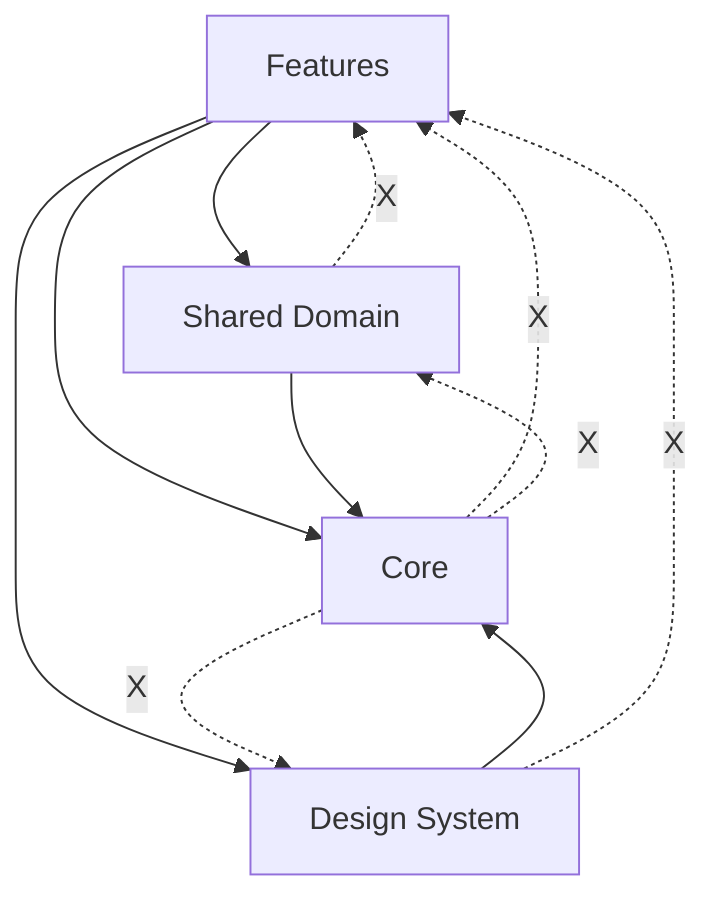

# Guía de Migración a Arquitectura Feature-Based con Design System

## Índice
1. [Visión General](#visión-general)
2. [Gestión de Datos Transversales](#gestión-de-datos-transversales)
3. [Design System](#design-system)
4. [Scripts de Migración](#scripts-de-migración)
5. [Plan de Implementación](#plan-de-implementación)

## Visión General

Esta guía extiende el FEATURE_BASED_REFACTORING_GUIDE.md con soluciones para:
- Manejo de datos compartidos entre features
- Prevención de dependencias circulares
- Implementación de un Design System
- Scripts automatizados de migración

## Gestión de Datos Transversales

### Problema: Datos Compartidos Entre Features

Los datos como Usuario, Quotations y otros modelos necesitan ser accesibles desde múltiples features sin crear dependencias circulares.

### Solución: Arquitectura de Capas Híbrida

```
lib/
├── features/                    # Features independientes
│   ├── auth/
│   ├── artist/
│   ├── customer/
│   └── quotation/
├── shared/                      # Datos y lógica compartida
│   ├── domain/
│   │   ├── models/             # Modelos compartidos
│   │   │   ├── user.dart
│   │   │   ├── quotation.dart
│   │   │   └── artist.dart
│   │   ├── repositories/       # Interfaces de repositorios
│   │   │   ├── user_repository.dart
│   │   │   └── quotation_repository.dart
│   │   └── services/           # Servicios transversales
│   │       ├── auth_service.dart
│   │       └── user_service.dart
│   └── data/
│       ├── repositories/       # Implementaciones
│       └── api/
├── design_system/              # Sistema de diseño
└── core/                       # Configuraciones base
```

### Reglas de Dependencias



1. **Features** pueden depender de:
   - Shared Domain (modelos, interfaces)
   - Design System
   - Core

2. **Shared Domain** puede depender de:
   - Core
   - NO puede depender de Features

3. **Design System** puede depender de:
   - Core
   - NO puede depender de Features o Shared

### Ejemplo: Usuario Transversal

```dart
// shared/domain/models/user.dart
@freezed
class User with _$User {
  const factory User({
    required String id,
    required String email,
    required UserType type,
    String? artistId,
    String? customerId,
  }) = _User;
}

// shared/domain/services/user_service.dart
abstract class UserService {
  Stream<User?> get currentUser;
  Future<void> updateUser(User user);
}

// features/artist/profile/bloc/artist_profile_bloc.dart
class ArtistProfileBloc extends Bloc<ArtistProfileEvent, ArtistProfileState> {
  final UserService _userService; // Usa el servicio compartido
  final ArtistRepository _artistRepository;
  
  // El bloc escucha cambios en el usuario
  StreamSubscription? _userSubscription;
  
  ArtistProfileBloc({
    required UserService userService,
    required ArtistRepository artistRepository,
  }) : _userService = userService,
       _artistRepository = artistRepository,
       super(const ArtistProfileState.initial()) {
    _userSubscription = _userService.currentUser.listen((user) {
      if (user?.artistId != null) {
        add(ArtistProfileEvent.userUpdated(user!));
      }
    });
  }
}
```

### Ejemplo: Quotations Compartidas

```dart
// shared/domain/models/quotation.dart
@freezed
class Quotation with _$Quotation {
  const factory Quotation({
    required String id,
    required String artistId,
    required String customerId,
    required QuotationStatus status,
    required Money estimatedCost,
  }) = _Quotation;
}

// features/artist/quotations/bloc/artist_quotations_bloc.dart
class ArtistQuotationsBloc extends Bloc<...> {
  Stream<List<Quotation>> getArtistQuotations(String artistId) {
    // Filtra solo las quotations del artista
  }
}

// features/customer/quotations/bloc/customer_quotations_bloc.dart
class CustomerQuotationsBloc extends Bloc<...> {
  Stream<List<Quotation>> getCustomerQuotations(String customerId) {
    // Filtra solo las quotations del cliente
  }
}
```

## Design System

### Estructura del Design System

```
design_system/
├── tokens/
│   ├── colors.dart
│   ├── typography.dart
│   ├── spacing.dart
│   └── shadows.dart
├── atoms/
│   ├── buttons/
│   │   ├── ds_button.dart
│   │   ├── ds_icon_button.dart
│   │   └── ds_text_button.dart
│   ├── inputs/
│   │   ├── ds_text_field.dart
│   │   └── ds_dropdown.dart
│   └── feedback/
│       ├── ds_loading.dart
│       └── ds_error.dart
├── molecules/
│   ├── cards/
│   │   ├── ds_artist_card.dart
│   │   └── ds_quotation_card.dart
│   └── forms/
│       └── ds_form_field.dart
├── organisms/
│   ├── navigation/
│   │   ├── ds_bottom_nav.dart
│   │   └── ds_app_bar.dart
│   └── lists/
│       └── ds_infinite_list.dart
├── templates/
│   ├── ds_page_template.dart
│   └── ds_form_template.dart
└── design_system.dart  # Barrel export
```

### Tokens de Diseño

```dart
// design_system/tokens/colors.dart
class DSColors {
  // Semantic colors
  static const primary = Color(0xFF6750A4);
  static const onPrimary = Color(0xFFFFFFFF);
  static const secondary = Color(0xFF625B71);
  static const onSecondary = Color(0xFFFFFFFF);
  
  // Surface colors
  static const surface = Color(0xFFFEF7FF);
  static const onSurface = Color(0xFF1D1B20);
  
  // Status colors
  static const success = Color(0xFF4CAF50);
  static const error = Color(0xFFBA1A1A);
  static const warning = Color(0xFFFF9800);
  
  // Role-specific colors
  static const artistPrimary = Color(0xFF2196F3);
  static const customerPrimary = Color(0xFF9C27B0);
}

// design_system/tokens/typography.dart
class DSTypography {
  static const headlineLarge = TextStyle(
    fontFamily: 'Poppins',
    fontSize: 32,
    fontWeight: FontWeight.w600,
    height: 1.25,
  );
  
  static const bodyMedium = TextStyle(
    fontFamily: 'Poppins',
    fontSize: 14,
    fontWeight: FontWeight.w400,
    height: 1.5,
  );
}

// design_system/tokens/spacing.dart
class DSSpacing {
  static const xs = 4.0;
  static const sm = 8.0;
  static const md = 16.0;
  static const lg = 24.0;
  static const xl = 32.0;
  static const xxl = 48.0;
}
```

### Componentes del Design System

```dart
// design_system/atoms/buttons/ds_button.dart
class DSButton extends StatelessWidget {
  final String label;
  final VoidCallback? onPressed;
  final DSButtonVariant variant;
  final DSButtonSize size;
  final bool isLoading;
  
  const DSButton({
    required this.label,
    this.onPressed,
    this.variant = DSButtonVariant.primary,
    this.size = DSButtonSize.medium,
    this.isLoading = false,
  });
  
  @override
  Widget build(BuildContext context) {
    return Material(
      color: _backgroundColor,
      borderRadius: BorderRadius.circular(_borderRadius),
      child: InkWell(
        onTap: isLoading ? null : onPressed,
        borderRadius: BorderRadius.circular(_borderRadius),
        child: Container(
          padding: _padding,
          child: isLoading
              ? DSLoading(size: DSLoadingSize.small)
              : Text(label, style: _textStyle),
        ),
      ),
    );
  }
}

// design_system/molecules/cards/ds_artist_card.dart
class DSArtistCard extends StatelessWidget {
  final String artistName;
  final String? imageUrl;
  final double rating;
  final VoidCallback? onTap;
  
  @override
  Widget build(BuildContext context) {
    return DSCard(
      onTap: onTap,
      child: Column(
        children: [
          DSAvatar(imageUrl: imageUrl),
          SizedBox(height: DSSpacing.sm),
          Text(artistName, style: DSTypography.titleMedium),
          DSRating(rating: rating),
        ],
      ),
    );
  }
}
```

## Scripts de Migración

### 1. Script Principal de Migración

```bash
#!/bin/bash
# scripts/migrate_to_features.sh

set -e

# Colores para output
RED='\033[0;31m'
GREEN='\033[0;32m'
YELLOW='\033[1;33m'
NC='\033[0m'

echo -e "${GREEN}=== Iniciando migración a arquitectura feature-based ===${NC}"

# Función para crear estructura de feature
create_feature_structure() {
    local feature=$1
    echo -e "${YELLOW}Creando estructura para feature: $feature${NC}"
    
    mkdir -p "lib/features/$feature"/{ui,bloc,models,data}
    mkdir -p "test/features/$feature"/{ui,bloc,data}
    
    # Crear archivo barrel export
    cat > "lib/features/$feature/${feature}_feature.dart" << EOF
// Export all public APIs of $feature feature
// UI exports
// Bloc exports  
// Model exports
EOF
}

# Función para migrar archivos
migrate_files() {
    local feature=$1
    local source_type=$2
    local dest_type=$3
    
    if [ -d "lib/$source_type/$feature" ]; then
        echo -e "Migrando $source_type/$feature..."
        cp -r "lib/$source_type/$feature"/* "lib/features/$feature/$dest_type/" 2>/dev/null || true
    fi
}

# Función para actualizar imports
update_imports() {
    local feature=$1
    echo -e "Actualizando imports para $feature..."
    
    find lib/features/$feature -name "*.dart" -type f -exec sed -i.bak \
        -e "s|package:inker_studio/ui/|package:inker_studio/features/|g" \
        -e "s|package:inker_studio/domain/blocs/|package:inker_studio/features/|g" \
        -e "s|package:inker_studio/domain/models/|package:inker_studio/shared/domain/models/|g" \
        {} \;
    
    # Limpiar archivos .bak
    find lib/features/$feature -name "*.dart.bak" -type f -delete
}

# Features a migrar
FEATURES=("auth" "artist" "customer" "quotation")

# Crear estructura shared
echo -e "${GREEN}Creando estructura shared...${NC}"
mkdir -p lib/shared/{domain/{models,repositories,services},data/{repositories,api}}

# Migrar modelos compartidos
echo -e "${GREEN}Migrando modelos compartidos...${NC}"
SHARED_MODELS=("user" "quotation" "money" "location")
for model in "${SHARED_MODELS[@]}"; do
    if [ -f "lib/domain/models/$model.dart" ]; then
        cp "lib/domain/models/$model.dart" "lib/shared/domain/models/"
        cp "lib/domain/models/$model.g.dart" "lib/shared/domain/models/" 2>/dev/null || true
        cp "lib/domain/models/$model.freezed.dart" "lib/shared/domain/models/" 2>/dev/null || true
    fi
done

# Migrar cada feature
for feature in "${FEATURES[@]}"; do
    echo -e "\n${GREEN}=== Migrando feature: $feature ===${NC}"
    
    create_feature_structure "$feature"
    
    # Migrar UI
    migrate_files "$feature" "ui" "ui"
    
    # Migrar BLoCs
    migrate_files "$feature" "domain/blocs" "bloc"
    
    # Migrar modelos específicos del feature
    if [ "$feature" != "auth" ] && [ "$feature" != "quotation" ]; then
        migrate_files "$feature" "domain/models" "models"
    fi
    
    # Migrar repositorios
    migrate_files "$feature" "data/repositories" "data"
    
    # Actualizar imports
    update_imports "$feature"
    
    echo -e "${GREEN}✓ Feature $feature migrado${NC}"
done

# Crear Design System
echo -e "\n${GREEN}Creando Design System...${NC}"
./scripts/create_design_system.sh

echo -e "\n${GREEN}=== Migración completada ===${NC}"
echo -e "${YELLOW}Próximos pasos:${NC}"
echo "1. Ejecutar: flutter pub get"
echo "2. Ejecutar: make build"
echo "3. Ejecutar: flutter analyze"
echo "4. Ejecutar pruebas: flutter test"
```

### 2. Script para Crear Design System

```bash
#!/bin/bash
# scripts/create_design_system.sh

set -e

echo "Creando estructura del Design System..."

# Crear directorios
mkdir -p lib/design_system/{tokens,atoms/{buttons,inputs,feedback},molecules/{cards,forms},organisms/{navigation,lists},templates}

# Crear tokens
cat > lib/design_system/tokens/colors.dart << 'EOF'
import 'package:flutter/material.dart';

class DSColors {
  DSColors._();
  
  // Primary colors
  static const primary = Color(0xFF6750A4);
  static const onPrimary = Color(0xFFFFFFFF);
  
  // Add more colors...
}
EOF

# Crear componente button
cat > lib/design_system/atoms/buttons/ds_button.dart << 'EOF'
import 'package:flutter/material.dart';
import '../../tokens/colors.dart';
import '../../tokens/typography.dart';

enum DSButtonVariant { primary, secondary, text }
enum DSButtonSize { small, medium, large }

class DSButton extends StatelessWidget {
  // Implementation...
}
EOF

# Crear barrel export
cat > lib/design_system/design_system.dart << 'EOF'
// Tokens
export 'tokens/colors.dart';
export 'tokens/typography.dart';
export 'tokens/spacing.dart';

// Atoms
export 'atoms/buttons/ds_button.dart';
// Add more exports...
EOF

echo "✓ Design System creado"
```

### 3. Script de Validación

```bash
#!/bin/bash
# scripts/validate_migration.sh

set -e

echo "=== Validando migración ==="

# Verificar estructura
echo "Verificando estructura de directorios..."
REQUIRED_DIRS=(
    "lib/features"
    "lib/shared"
    "lib/design_system"
    "lib/core"
)

for dir in "${REQUIRED_DIRS[@]}"; do
    if [ ! -d "$dir" ]; then
        echo "❌ Falta directorio: $dir"
        exit 1
    fi
done

# Verificar dependencias circulares
echo "Verificando dependencias circulares..."
dart run scripts/check_circular_dependencies.dart

# Ejecutar análisis
echo "Ejecutando análisis estático..."
flutter analyze

# Ejecutar pruebas
echo "Ejecutando pruebas..."
flutter test

echo "✅ Validación completada exitosamente"
```

### 4. Script Dart para Detectar Dependencias Circulares

```dart
// scripts/check_circular_dependencies.dart
import 'dart:io';

void main() {
  final dependencies = <String, Set<String>>{};
  
  // Analizar archivos
  final libDir = Directory('lib');
  final files = libDir
      .listSync(recursive: true)
      .whereType<File>()
      .where((f) => f.path.endsWith('.dart'));
  
  for (final file in files) {
    final content = file.readAsStringSync();
    final imports = RegExp(r"import\s+'package:inker_studio/(.+?)'")
        .allMatches(content)
        .map((m) => m.group(1)!)
        .toSet();
    
    dependencies[file.path] = imports;
  }
  
  // Detectar ciclos
  final visited = <String>{};
  final stack = <String>[];
  
  bool hasCycle(String node) {
    if (stack.contains(node)) {
      print('❌ Ciclo detectado: ${stack.join(' -> ')} -> $node');
      return true;
    }
    
    if (visited.contains(node)) return false;
    
    visited.add(node);
    stack.add(node);
    
    for (final dep in dependencies[node] ?? {}) {
      if (hasCycle(dep)) return true;
    }
    
    stack.removeLast();
    return false;
  }
  
  // Verificar cada archivo
  var hasCycles = false;
  for (final file in dependencies.keys) {
    if (hasCycle(file)) {
      hasCycles = true;
    }
  }
  
  if (!hasCycles) {
    print('✅ No se detectaron dependencias circulares');
  }
  
  exit(hasCycles ? 1 : 0);
}
```

## Plan de Implementación

### Fase 1: Preparación (Semana 1)
1. **Crear scripts de migración**
2. **Establecer estructura shared**
3. **Migrar modelos transversales**
4. **Configurar Design System base**

### Fase 2: Features Core (Semanas 2-3)
1. **Auth Feature**
   - Mantener UserService en shared
   - Feature solo maneja autenticación
   
2. **Profile Features**
   - Separar artist/customer profiles
   - Compartir modelo User desde shared

### Fase 3: Features Complejas (Semanas 4-5)
1. **Quotation Feature**
   - Modelo Quotation en shared
   - UI específica por rol en cada feature
   
2. **Portfolio/Booking Features**
   - Específicas por rol
   - Usan servicios compartidos

### Fase 4: Design System (Semana 6)
1. **Implementar componentes base**
2. **Migrar componentes existentes**
3. **Documentar uso**

### Fase 5: Validación (Semana 7)
1. **Ejecutar validaciones**
2. **Corregir dependencias**
3. **Optimizar imports**

### Fase 6: Limpieza (Semana 8)
1. **Eliminar código legacy**
2. **Actualizar documentación**
3. **Training del equipo**

## Comandos Útiles

```bash
# Migrar todo
./scripts/migrate_to_features.sh

# Validar migración
./scripts/validate_migration.sh

# Crear nuevo feature
./scripts/generate_feature.sh <feature_name>

# Verificar dependencias
dart run scripts/check_circular_dependencies.dart

# Generar código después de cambios
make build
```

## Métricas de Éxito

1. **Sin dependencias circulares** ✓
2. **Tests pasando al 100%** ✓
3. **Tiempo de build reducido** ✓
4. **Features independientes** ✓
5. **Design System consistente** ✓
6. **Datos compartidos sin acoplamiento** ✓

## Consideraciones Finales

- Los datos transversales viven en `shared/domain`
- Las features consumen pero no exponen datos
- El Design System es independiente
- Los scripts automatizan el 80% del trabajo
- La validación continua previene regresiones